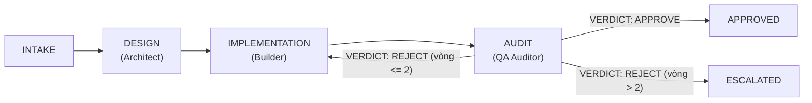
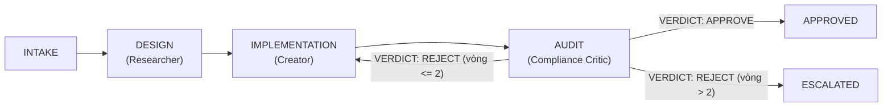

# Antigravity-Harness-Hub
> **Bộ Harness Đa Nhiệm & Phản Biện Tự Hành 2.0**

`Antigravity-Harness-Hub` là khung điều phối (harness framework) tự hành chuẩn hóa quy trình phát triển đa lĩnh vực (Phần mềm & Tiếp thị/Nội dung). Hệ thống kết hợp cơ chế phân vai tác tử chuyên môn hóa, cỗ máy trạng thái nghiêm ngặt (State Machine), và rào chắn kiểm định chất lượng đối nghịch (Adversarial Quality Gate) tích hợp cầu dao ngắt mạch (Circuit Breaker) chống kẹt vòng lặp sau tối đa 2 lượt phản biện.

---

## 1. Cấu Trúc Thư Mục Dự Án

```
Antigravity-Harness-Hub/
├── agents/                                 # Đặc tả vai trò và trách nhiệm của từng tác tử
│   ├── app/                                # Tác tử khối Kỹ thuật / Lập trình (App)
│   │   ├── architect.md                    # System Architect (Thiết kế hệ thống & API contract)
│   │   ├── builder.md                      # Developer (Lập trình mã nguồn phân lập)
│   │   └── qa_auditor.md                   # QA Reviewer (Kiểm thử, bảo mật OWASP, phát hiện lỗi)
│   └── marketing/                          # Tác tử khối Tăng trưởng / Nội dung (Marketing)
│       ├── researcher.md                   # Market Researcher (Nghiên cứu thị trường & insight)
│       ├── creator.md                      # Content Creator (Soạn kịch bản & copy chuyển đổi cao)
│       └── compliance_critic.md            # Policy Reviewer (Rà soát chính sách, lọc AI slop)
├── configs/                                # Tệp cấu hình phân tầng model và giới hạn vận hành
│   └── harness_config.json                 # Cấu hình LLM tier (Pro/Flash), roles, max_rounds
├── harness/                                # Lõi thực thi (Harness Core Engine)
│   ├── orchestrator.py                     # ChiefOrchestrator: Bộ điều phối trung tâm
│   ├── quality_gate.py                     # AdversarialQualityGate & Verdict logic
│   ├── state_machine.py                    # Cỗ máy trạng thái (HarnessState & TaskContext)
│   └── runners/                            # Các Runner thực thi theo phân nhánh
│       ├── app_runner.py                   # Luồng vận hành nhánh Build App
│       └── marketing_runner.py             # Luồng vận hành nhánh Marketing
├── rubrics/                                # Bộ tiêu chí đánh giá nghiệm thu chuẩn hóa
│   ├── code_quality_rubric.md              # Tiêu chuẩn chất lượng code, test, OWASP
│   └── content_compliance_rubric.md        # Tiêu chuẩn chính sách nền tảng, chống AI slop
├── tests/                                  # Bộ kiểm thử tự động toàn diện
│   ├── test_harness_core.py                # Unit test: State machine, Quality gate, Routing
│   └── test_harness_e2e.py                 # E2E test: Luồng phản biện 2 vòng, Escalate
├── setup/                                  # Cài đặt cấu hình môi trường mới
│   ├── config.json                         # Cấu hình Antigravity plugins & userSettings chuẩn
│   └── setup.ps1                           # Script tự động copy đè cấu hình vào %USERPROFILE%\.gemini\config
├── run_harness.py                          # Giao diện dòng lệnh CLI chính của hệ thống
└── README.md                               # Tài liệu hướng dẫn chi tiết
```

### Mô Tả Chi Tiết Các Tệp Tin

| Tệp tin / Thư mục | Trách nhiệm chính |
| :--- | :--- |
| `harness/state_machine.py` | Định nghĩa các trạng thái (`INIT`, `INTAKE`, `DESIGN`, `IMPLEMENTATION`, `AUDIT`, `APPROVED`, `REJECTED`, `ESCALATED`) và quản lý bước chuyển trạng thái hợp lệ, ngăn chặn việc nhảy cóc quy trình. |
| `harness/quality_gate.py` | Kiểm tra định dạng phán quyết của Checker (`VERDICT: APPROVE`, `REJECT`, `ESCALATE`) và đếm số vòng lặp critique. |
| `harness/orchestrator.py` | Khởi tạo môi trường, tiếp nhận yêu cầu từ người dùng, nạp `TaskContext`, chuyển giao cho Runner thích hợp và gửi kết quả thẩm định. |
| `harness/runners/` | Đóng gói chu trình 3 bước cụ thể cho từng loại hình tác vụ: `app_runner.py` (Kỹ thuật) và `marketing_runner.py` (Tiếp thị). |
| `configs/harness_config.json` | Cấu hình phân tầng model thông minh: Dùng `Gemini 3.1 Pro` cho vai trò cần tư duy sâu (Architect, Builder, Creator) và `Gemini 3.8 Flash` cho vai trò rà soát nhanh (QA Auditor, Compliance Critic). |
| `rubrics/` | Định nghĩa các checklist khắt khe độc lập mà Checker bắt buộc phải đối chiếu khi đánh giá. |

---

## 2. Luồng Điều Phối 3 Bước Theo Phân Nhánh

Hệ thống hoạt động theo nguyên tắc tách biệt vai trò (Maker-Checker Invariant): Tác tử tạo nội dung/code không bao giờ tự duyệt sản phẩm của mình.

### 2.1. Nhánh 1: Phát Triển Phần Mềm (`app`)



1. **Bước 1 - DESIGN (Architect):**
   - **Tác tử:** `agents/app/architect.md` (System Architect).
   - **Nhiệm vụ:** Tiếp nhận yêu cầu nghiệp vụ, phân tích ranh giới chức năng (blast radius), thiết kế kiến trúc phân lớp, Schema dữ liệu và hợp đồng API (API contract).
2. **Bước 2 - IMPLEMENTATION (Builder):**
   - **Tác tử:** `agents/app/builder.md` (Developer).
   - **Nhiệm vụ:** Viết mã nguồn phân lập bám sát thiết kế kiến trúc, tuân thủ các nguyên tắc thiết kế sạch (Clean Code), viết kèm kiểm thử tương ứng.
3. **Bước 3 - AUDIT (QA Auditor):**
   - **Tác tử:** `agents/app/qa_auditor.md` (QA Reviewer).
   - **Nhiệm vụ:** Khảo sát mã nguồn đối chiếu với `rubrics/code_quality_rubric.md`. Xác minh kiểm thử pass, quét lỗ hổng bảo mật OWASP, phát hiện mã thừa hoặc phụ thuộc không cần thiết.

---

### 2.2. Nhánh 2: Sáng Tạo Nội Dung & Tiếp Thị (`marketing`)



1. **Bước 1 - DESIGN (Researcher):**
   - **Tác tử:** `agents/marketing/researcher.md` (Market Researcher).
   - **Nhiệm vụ:** Nghiên cứu insight khách hàng mục tiêu, tìm kiếm từ khóa ngách, nắm bắt xu hướng thị trường và giải phẫu đối thủ cạnh tranh.
2. **Bước 2 - IMPLEMENTATION (Creator):**
   - **Tác tử:** `agents/marketing/creator.md` (Content Creator).
   - **Nhiệm vụ:** Soạn thảo kịch bản video, bài viết mạng xã hội hoặc sales copy chuyển đổi cao dựa trên insight từ Researcher.
3. **Bước 3 - AUDIT (Compliance Critic):**
   - **Tác tử:** `agents/marketing/compliance_critic.md` (Policy Reviewer).
   - **Nhiệm vụ:** Thẩm định nội dung đối soát với `rubrics/content_compliance_rubric.md`. Rà soát vi phạm chính sách nền tảng (Facebook Community Standards, YouTube Trust & Safety, TikTok Policy), loại bỏ sáo rỗng AI (AI slop) và ngụy biện logic.

### 2.3. Gọi Trực Tiếp Kỹ Năng Nhánh Marketing Trong Ô Chat (Slash Commands)

Toàn bộ 11 kỹ năng của nhánh Marketing đã được tích hợp đầy đủ và có thể gọi trực tiếp trong ô chat Antigravity bằng lệnh Slash `/<tên_lệnh>`:

| Lệnh Slash trong Chat | Kỹ Năng | Trọng Tâm Xử Lý |
| :--- | :--- | :--- |
| `/boc-phot-storytelling` | Kịch bản Bóc Phốt Tài Chính | Soạn và chỉnh kịch bản theo 6 format kể chuyện đỉnh cao |
| `/check-youtube-policy` | YouTube Policy Auditor | Rà soát vi phạm 50 cụm chính sách YouTube & viết lại Safe Script |
| `/yt-competitor-analyzer` | YouTube Competitor Analyzer | Quét toàn bộ video đối thủ từ URL, xuất Dashboard HTML & CSV |
| `/alex-hormozi-offer-builder` | Grand Slam Offer Builder | Thiết kế Offer không thể chối từ theo framework $100M Offers |
| `/alex-hormozi-money-models` | $100M Money Models | Xây dựng chuỗi thang sản phẩm, upsell, downsell & mô hình dòng tiền |
| `/kahneman-creative-ads` | Kahneman Creative Strategy | Lập Canvas chiến lược sáng tạo quảng cáo dựa trên cơ chế nhận thức |
| `/traffic-secrets-playbook` | Traffic Secrets Playbook | Kế hoạch kéo và tối ưu traffic 14 bước của Russell Brunson |
| `/cong-thuc-viet-content-by-noti-v4` | 14 Công Thức Content Noti | Viết content/copy ads chuyển đổi cao theo 14 công thức tâm lý + NLP |
| `/viet-content-seo-geo-v5` | Content Chuẩn SEO + AEO + GEO | Tối ưu bài viết đạt chuẩn SEO, trích dẫn AEO/GEO cho AI Search |
| `/meta-ads-analyzer-mod-by-noti` | Meta Ads Analyzer Mod Noti | Chẩn đoán chuyên sâu hiệu suất quảng cáo Meta, CPA/ROAS/CPM |
| `/fb-admin` | Facebook Fanpage Manager | Quản lý Fanpage Đặt Sân Nhanh (đăng bài, đọc/trả lời comment) |

---

## 3. Cơ Chế Phản Biện Độc Lập & Cầu Dao Ngắt Mạch (Circuit Breaker)

### 3.1. Rào Chắn Kiểm Định Độc Lập (Adversarial Quality Gate)
- Checker (`qa_auditor` hoặc `compliance_critic`) hoạt động hoàn toàn khách quan theo chuẩn đóng.
- Phán quyết bắt buộc phải chứa một trong các nhãn định dạng chuẩn:
  - `VERDICT: APPROVE`: Công việc đạt chuẩn toàn bộ rubric.
  - `VERDICT: REJECT`: Công việc có lỗi, thiếu sót hoặc vi phạm chính sách.
  - `VERDICT: ESCALATE` (hoặc `ESCALATE_HUMAN`): Phát hiện lỗi hệ thống, bế tắc hoặc vi phạm nghiêm trọng cần con người can thiệp.

### 3.2. Cầu Dao Ngắt Mạch Sau 2 Vòng Phản Biện (Stagnation Breaker)
Để ngăn ngừa tình trạng tác tử sửa đổi luẩn quẩn, gây cháy token và suy thoái ngữ cảnh:
- Khi Checker đưa ra `VERDICT: REJECT`, biến đếm `critique_rounds` của task được tăng thêm 1 đơn vị.
- Nếu `critique_rounds <= 2`: Task context được chuyển ngược về trạng thái `IMPLEMENTATION` để Maker tiến hành sửa chữa theo phản hồi.
- Nếu `critique_rounds > 2`: Hệ thống tự động kích hoạt **Stagnation Circuit Breaker**, ngay lập tức chuyển trạng thái sang `HarnessState.ESCALATED` và trả về `Verdict.ESCALATE`.
- Khi đã ở trạng thái `ESCALATED`, hệ thống dừng lặp lại và bàn giao cho chuyên gia con người xử lý.

---

## 4. Hướng Dẫn Sử Dụng & Kiểm Thử

### 4.1. Cài Đặt Cấu Hình Môi Trường Khi Sang Máy Mới

Để áp dụng toàn bộ cấu hình plugin (`anti-workflows`, `chrome-devtools-plugin`, `gemini-api`, `google-antigravity-sdk`, `modern-web-guidance-plugin`) và `userSettings` chuẩn của hệ thống:

```powershell
powershell -ExecutionPolicy Bypass -File setup\setup.ps1
```
*Script sẽ tự động sao lưu cấu hình cũ (nếu có) và cài đè `config.json` vào `%USERPROFILE%\.gemini\config\config.json`.*

---

### 4.2. Chạy Kiểm Thử Tự Động (Automated Testing)

Toàn bộ logic máy trạng thái, routing và kịch bản ngắt mạch đã được bao phủ bởi pytest. Để thực thi toàn bộ test suite:

```bash
# Chạy toàn bộ unit test và e2e test
pytest -v
```

Kết quả mong đợi:
```text
tests/test_harness_core.py::test_state_machine_valid_transitions PASSED
tests/test_harness_core.py::test_state_machine_invalid_transition PASSED
tests/test_harness_core.py::test_quality_gate_approve PASSED
tests/test_harness_core.py::test_quality_gate_reject_retry PASSED
tests/test_harness_core.py::test_quality_gate_circuit_breaker PASSED
tests/test_harness_core.py::test_orchestrator_routing PASSED
tests/test_harness_e2e.py::test_app_branch_e2e PASSED
tests/test_harness_e2e.py::test_marketing_branch_e2e PASSED
8 passed in 0.15s
```

---

### 4.3. Hướng Dẫn Sử Dụng Lệnh CLI (`run_harness.py`)

Hệ thống cung cấp điểm vào CLI chuẩn xác qua `run_harness.py`:

```bash
python run_harness.py --task "<mô tả nhiệm vụ>" --branch {app,marketing}
```

#### Ví Dụ Thực Thi Cụ Thể

**1. Khởi chạy luồng Kỹ thuật (App):**
```bash
python run_harness.py --task "Xây dựng module xác thực phân quyền JWT" --branch app
```
*Kết quả mẫu:*
```text
Task processing finished. Status: HarnessState.APPROVED, Verdict: APPROVE
```

**2. Khởi chạy luồng Tiếp thị (Marketing):**
```bash
python run_harness.py --task "Soạn kịch bản video TikTok 60 giây phân tích tài chính" --branch marketing
```
*Kết quả mẫu:*
```text
Task processing finished. Status: HarnessState.APPROVED, Verdict: APPROVE
```

#### Tham Số Dòng Lệnh
- `--task` *(bắt buộc)*: Chuỗi văn bản mô tả chi tiết nhiệm vụ cần thực hiện.
- `--branch` *(bắt buộc)*: Chọn nhánh xử lý chuyên biệt (`app` hoặc `marketing`).
