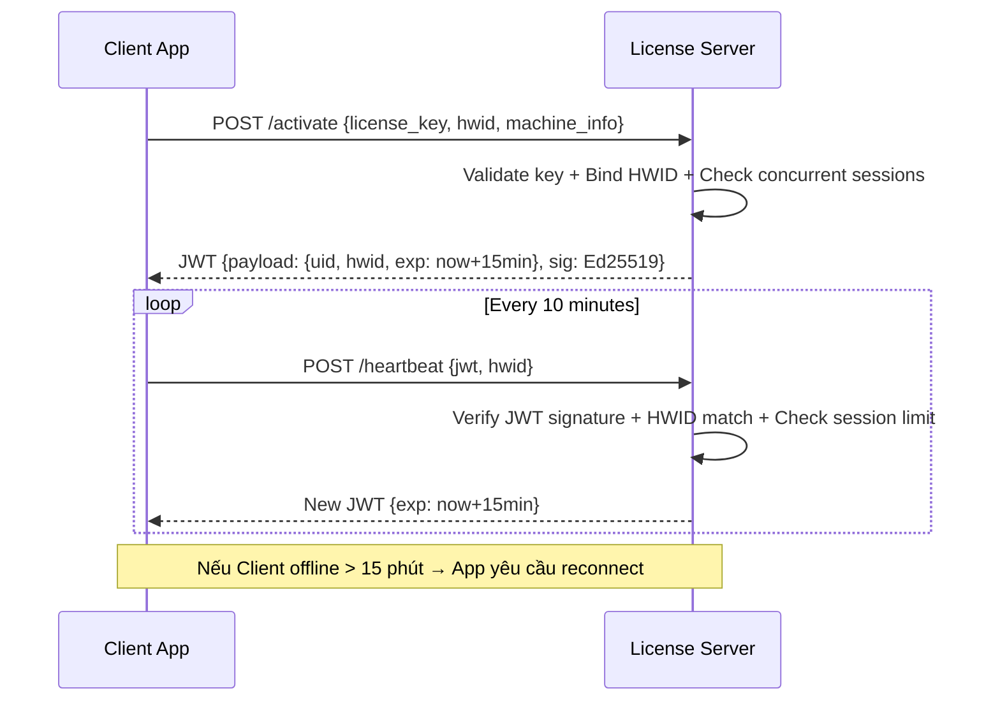

# Defense Playbook: Cẩm Nang 5 Trụ Cột Phòng Thủ Bản Quyền

Tài liệu này là nguồn tham chiếu cho Bước 4 của skill `/reverse-lab` — Xuất Lộ trình Gia cố (Actionable Hardening Roadmap). Đọc khi cần hướng dẫn triển khai cụ thể cho từng trụ cột phòng thủ.

> **Nguyên tắc cốt lõi: Zero Trust Client**
> Không bao giờ tin tưởng bất kỳ kết quả kiểm tra bản quyền nào chạy hoàn toàn ở phía Client. Mọi quyết định quan trọng phải được Server xác nhận và Server phải là nguồn chân lý duy nhất (Single Source of Truth).

---

## Trụ Cột 1: Kiến Trúc Thin-Client (Server-side Core Processing)

### Bản chất
Đây là biện pháp **triệt để và hiệu quả nhất**. Kể cả khi kẻ gian bẻ khóa hoàn toàn giao diện phần mềm, nếu không có tài khoản hợp lệ kết nối lên Server, app chỉ là một "vỏ rỗng".

### Nguyên tắc phân tách
```
Client (App Desktop)          Server (API)
──────────────────────        ─────────────────────────
UI / UX rendering         →  Core business logic
Input collection          →  Data processing engine
Result display            ←  Validated computation result
Progress tracking         ←  Real-time session state
```

### Cách triển khai thực tế
1. **Xác định "Crown Jewel" của phần mềm:** Tính năng gì là lý do người dùng trả tiền? (Ví dụ: Thuật toán xử lý dữ liệu, bộ mẫu template cao cấp, engine tính toán AI).
2. **Đẩy Crown Jewel lên Server:** Triển khai thành API endpoint (REST/gRPC). Client chỉ gửi tham số, Server trả về kết quả.
3. **Server luôn kiểm tra session token hợp lệ trước khi xử lý:**
   ```python
   # Ví dụ Flask API
   @app.route('/api/v1/process', methods=['POST'])
   @require_valid_session_token  # decorator xác thực JWT + HWID
   def process_data():
       result = core_engine.process(request.json)
       return jsonify(result)
   ```

### Mức độ ưu tiên: 🔴 CRITICAL
Nếu chỉ được làm 1 biện pháp, chọn biện pháp này.

---

## Trụ Cột 2: Session Heartbeat & JWT Token Ngắn Hạn

### Bản chất
Ngăn chặn: (1) chia sẻ 1 key cho nhiều máy, (2) cache token hợp lệ offline vĩnh viễn, (3) thu hồi bản quyền từ xa ngay lập tức.

### Quy trình hoàn chỉnh



### Cấu trúc JWT Payload đề xuất
```json
{
  "sub": "user_id_123",
  "hwid": "sha256_of_cpu_mac_disk",
  "plan": "professional",
  "features": ["export", "cloud_sync", "api_access"],
  "iat": 1700000000,
  "exp": 1700000900,
  "jti": "unique_token_id_per_session"
}
```

### Ký JWT bằng Ed25519 (Bất đối xứng)
- **Server** giữ **Private Key** để ký token.
- **Client** chỉ có **Public Key** để xác minh chữ ký.
- Kẻ gian có thể đọc được Public Key trong app nhưng **không thể tự ký token giả** vì thiếu Private Key.

### Giới hạn phiên đồng thời (Concurrent Session Control)
- Lưu `{license_key → [hwid, last_seen]}` trong Redis/Database.
- Nếu HWID mới kết nối trong khi HWID cũ vẫn còn active, ghi log cảnh báo và tuỳ chính sách: cho phép (chuyển phiên) hoặc từ chối.

---

## Trụ Cột 3: Ảo Hóa Mã Máy (Code Virtualization)

### Sự khác biệt giữa Obfuscation và Virtualization
| Tiêu chí | Obfuscation thông thường | Code Virtualization |
|:---|:---|:---|
| **Cơ chế** | Đổi tên biến, mã hóa string, làm rối control flow | Biên dịch code thành bytecode riêng chạy trên VM nội bộ |
| **Hiệu quả chống Static Analysis** | Chậm đáng kể | Gần như không thể đọc |
| **Hiệu quả chống Dynamic Analysis** | Thấp (đặt Breakpoint vẫn dò được) | Cao (bytecode VM không phải x86 chuẩn) |
| **Tác động hiệu năng** | Không đáng kể | ~10-30% chậm hơn với đoạn code được bảo vệ |

### Công cụ thương mại uy tín
1. **VMProtect** (vmprotect.ru): Hỗ trợ C/C++, Delphi, .NET. Ảo hóa và Mutation mode.
2. **Themida / WinLicense** (oreans.com): Đầy đủ Anti-Debug, Anti-VM, Code Virtualization, License Manager tích hợp.
3. **Enigma Protector**: Nhẹ hơn, phù hợp app quy mô vừa.

### Chiến lược áp dụng
- **Không ảo hóa toàn bộ app** (sẽ rất chậm và khó debug). Chỉ bảo vệ **các hàm nhạy cảm nhất**:
  - Hàm kiểm tra chữ ký JWT (`VerifySignature`)
  - Hàm xác minh HWID (`CollectAndHashHWID`)
  - Hàm Anti-Debug (`DetectDebuggerPresence`)
  - Hàm khởi tạo kết nối bảo mật (`InitSecureChannel`)

---

## Trụ Cột 4: Anti-Debug & Runtime Anti-Tamper (Watchdog)

### 4.1 Phát hiện Debugger (Anti-Debugging)

**Cấp độ 1 — Win32 API cơ bản:**
```csharp
// C# example
[DllImport("kernel32.dll")]
static extern bool IsDebuggerPresent();

[DllImport("kernel32.dll")]
static extern bool CheckRemoteDebuggerPresent(IntPtr hProcess, ref bool isDebuggerPresent);
```

**Cấp độ 2 — Kiểm tra PEB (Process Environment Block):**
```cpp
// C++ - đọc trực tiếp cờ BeingDebugged trong PEB
// khó bypass hơn API chuẩn
bool IsBeingDebugged() {
    return *(PBYTE)(__readgsqword(0x60) + 2) != 0; // x64
}
```

**Cấp độ 3 — Timing Attack (đo độ trễ RDTSC):**
```cpp
// Khi có Breakpoint, CPU dừng → thời gian giữa 2 điểm đo tăng bất thường
unsigned __int64 t1 = __rdtsc();
// ... đoạn code mồi ...
unsigned __int64 t2 = __rdtsc();
if (t2 - t1 > THRESHOLD) { /* Phát hiện Debugger/Breakpoint */ }
```

### 4.2 Watchdog Thread (Giám sát tính toàn vẹn RAM)

**Nguyên lý:** Luồng ngầm chạy song song tính CRC/Hash của chính phân vùng `.text` (code section) trong RAM. Nếu byte nào bị thay đổi (dấu hiệu của Memory Patching), kích hoạt phản ứng.

```csharp
// C# pseudo-code
void WatchdogThread() {
    byte[] originalCodeHash = ComputeHash(GetCodeSection());
    while (true) {
        Thread.Sleep(random_interval_ms); // Ngẫu nhiên để khó dự đoán
        byte[] currentHash = ComputeHash(GetCodeSection());
        if (!currentHash.SequenceEqual(originalCodeHash)) {
            TriggerAntiTamperResponse(); // Xem mục 4.3
        }
    }
}
```

### 4.3 Chiến lược Phản ứng (Response Strategy)
Không nên thoát app ngay lập tức — kẻ gian sẽ biết đặt Breakpoint ở đâu để bypass. Thay vào đó:
- **Phản ứng trễ ngẫu nhiên:** Tiếp tục chạy trong 5-30 phút rồi mới đưa vào vòng lặp vô hạn hoặc crash bất ngờ.
- **Dữ liệu sai lệch âm thầm:** Tính toán ra kết quả sai một cách có kiểm soát, khiến kẻ gian nghĩ crack thành công nhưng app hoạt động không đúng.
- **Gửi cảnh báo lên Server:** Log IP, HWID, timestamp của máy đang cố bypass.

### 4.4 Phát hiện Môi trường Ảo hóa (Anti-VM)
```cpp
// Kiểm tra MAC address của VMware/VirtualBox
const char* vmMacPrefixes[] = { "00:0C:29", "00:50:56", "08:00:27" };

// Kiểm tra registry key của VMware Tools
HKEY hKey;
if (RegOpenKeyEx(HKEY_LOCAL_MACHINE, 
    "SOFTWARE\\VMware, Inc.\\VMware Tools", ...) == ERROR_SUCCESS) {
    // Đang chạy trong VMware
}
```

---

## Trụ Cột 5: SSL Certificate Pinning & Chữ Ký Số Response

### 5.1 SSL Certificate Pinning

**Cơ chế:** Nhúng cứng (hardcode) fingerprint SHA-256 của chứng chỉ Server vào trong mã nguồn ứng dụng. App từ chối kết nối với bất kỳ chứng chỉ nào không khớp, kể cả chứng chỉ được ký bởi CA được hệ điều hành tin tưởng.

```csharp
// C# với HttpClient
var handler = new HttpClientHandler();
handler.ServerCertificateCustomValidationCallback = (message, cert, chain, errors) => {
    // Chỉ chấp nhận đúng fingerprint đã nhúng
    string expectedThumbprint = "A3:B2:C1..."; // SHA-256 fingerprint của cert Server
    return cert.GetCertHashString(HashAlgorithmName.SHA256) == expectedThumbprint;
};
```

**Lưu ý quan trọng:** Cần có cơ chế **cập nhật fingerprint** khi cert Server hết hạn (ví dụ: nhúng 2-3 fingerprint backup, hoặc fetch fingerprint mới từ endpoint riêng có xác thực).

### 5.2 Ký số Response bằng Ed25519

**Quy trình:**
1. **Server** ký payload response bằng **Ed25519 Private Key** trước khi trả về:
   ```python
   from cryptography.hazmat.primitives.asymmetric.ed25519 import Ed25519PrivateKey
   
   private_key = Ed25519PrivateKey.from_private_bytes(SECRET_KEY_BYTES)
   signature = private_key.sign(response_body_bytes)
   # Gửi response + signature trong header: X-Signature: base64(signature)
   ```

2. **Client** xác minh chữ ký bằng **Ed25519 Public Key** đã nhúng cứng:
   ```csharp
   // Nếu xác minh thất bại → KHÔNG tiến hành kích hoạt dù response có đúng format
   bool isValid = Ed25519.Verify(signature, responseBody, embeddedPublicKey);
   if (!isValid) { throw new SecurityException("Response integrity compromised!"); }
   ```

**Tại sao Ed25519 tốt hơn RSA trong trường hợp này:**
- Key nhỏ hơn (32 bytes thay vì 2048+ bytes) → Dễ nhúng vào code hơn
- Ký và xác minh nhanh hơn RSA đáng kể
- Không dễ bị tấn công timing attack như RSA

---

## Bảng Tổng Hợp: Biện Pháp vs. Vector Tấn Công

| Biện pháp phòng thủ | Chống Nhóm 1 (Disk Patch) | Chống Nhóm 2 (Memory Patch) | Chống Nhóm 3 (Network) | Chống Nhóm 4 (Environment) |
|:---|:---:|:---:|:---:|:---:|
| **Thin-Client Architecture** | ✅ Hiệu quả cao | ✅ Hiệu quả cao | ✅ Hiệu quả cao | ✅ Hiệu quả cao |
| **JWT Heartbeat + Session Control** | ❌ Không áp dụng | ❌ Không áp dụng | ✅ Hiệu quả cao | ✅ HWID binding |
| **Code Virtualization** | ✅ Rất cao | ⚠️ Vừa | ❌ Không áp dụng | ❌ Không áp dụng |
| **Anti-Debug + Watchdog Thread** | ✅ Vừa | ✅ Hiệu quả cao | ❌ Không áp dụng | ✅ Anti-VM |
| **SSL Pinning + Ed25519** | ❌ Không áp dụng | ❌ Không áp dụng | ✅ Rất cao | ❌ Không áp dụng |
| **Hash SHA-256 tệp trên đĩa** | ✅ Vừa | ❌ **KHÔNG hiệu quả** | ❌ Không áp dụng | ❌ Không áp dụng |
| **Obfuscation thông thường** | ⚠️ Chậm tấn công | ❌ Kém hiệu quả | ❌ Không áp dụng | ❌ Không áp dụng |
