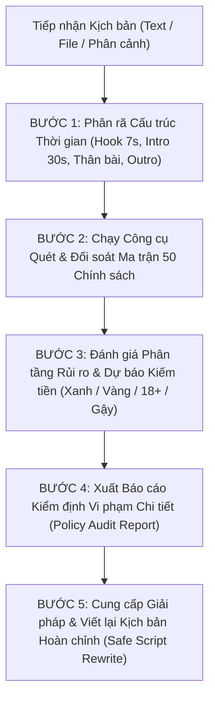

# YouTube Policy Auditor Skill (`/check-youtube-policy`)

Kỹ năng chuyên sâu dành cho **Trọng tài Kiểm định Chính sách YouTube Cấp cao (YouTube Trust & Safety & Policy Specialist)**. Kỹ năng này đóng vai trò như một màng lọc an toàn tối thượng, rà soát từng câu chữ, tình tiết trong kịch bản video YouTube (video dài, Shorts, Livestream) trước khi tiến hành thu âm, quay dựng, nhằm đảm bảo kịch bản **100% tuân thủ toàn bộ 50 chính sách cốt lõi của YouTube**, đạt trạng thái **Bật kiếm tiền Đô la Xanh**, giữ vững kênh an toàn không bao giờ bị dính gậy bản quyền, gậy cộng đồng hay bị bóp tương tác.

---

## 1. NGUỒN TRI THỨC NỀN TẢNG (KNOWLEDGE BASE)

Toàn bộ logic kiểm định dựa trên **ma trận 8 cụm / 50 chính sách chính thức** đã được hệ thống hoá trong:
`plugins/marketing/skills/check-youtube-policy/references/policy_rules_matrix.md`

Skill ship kèm **4 tài liệu tham chiếu** (ma trận chính sách, quy chuẩn nhà quảng cáo, hướng dẫn EDSA, từ điển từ ngữ an toàn).
> ⚠️ **Bản crawl thô 50 tệp chính sách KHÔNG được đóng gói trong repo này.** Ma trận là bản hệ thống hoá 8 cụm từ 50 tài liệu gốc.
> Vì vậy mọi kết luận phải dựa trên nội dung ma trận, không được giả định có bản gốc để tra cứu thêm.

> **Ràng buộc trích dẫn (BẮT BUỘC):** chỉ được viện dẫn mã chính sách / đường dẫn trợ giúp **có thật trong `references/policy_rules_matrix.md`**.
> Nếu kịch bản chạm chủ đề không có trong ma trận → ghi rõ *"chủ đề này ngoài phạm vi dữ liệu của skill, cần kiểm tra thủ công trên Trung tâm trợ giúp YouTube"*, **KHÔNG tự sinh mã chính sách**.

### 8 Cụm Chính sách cốt lõi được đối soát:
1. **`01_Kiem_Tien_Va_YPP`**: Chính sách kiếm tiền kênh (`1311392`), Nguyên tắc nội dung phù hợp với nhà quảng cáo (`6162278`), Kiếm tiền Shorts (`12504220`), Tắt kiếm tiền (`1727191`), Biểu tượng kiếm tiền (`9208564`).
2. **`02_Ban_Quyen_Va_Content_ID`**: Bản quyền YouTube (`2797466`), Đơn kiện bản quyền DMCA (`6013276`), Học thuyết Hợp lý hóa (Fair Use).
3. **`03_Nguyen_Tac_Cong_Dong_Chung`**: Nguyên tắc cộng đồng (`9288567`), Trách nhiệm của nhà sáng tạo (`7650329`), Lưu ý về nguyên tắc (`10767342`).
4. **`04_Noi_Dung_Nhay_Cam_Va_Bao_Luc`**: Ngôn từ thô tục (`10072685`), Lời nói hận thù (`2801939`), Nội dung gây hại/nguy hiểm (`2801964`), Ảnh khỏa thân & tình dục (`2802002`), Bạo lực phản cảm (`2802008`), Tự tử & tự hại (`2802245`), Quấy rối bắt nạt (`2802268`), Súng cầm tay (`7667605`), Tổ chức tội phạm (`9229472`).
5. **`05_Thong_Tin_Sai_Lech_Va_Spam`**: Thông tin y tế sai lệch (`13813322`), Sai lệch bầu cử (`10835034`), Spam & lừa đảo (`2801973`), Đường link ngoài (`9054257`), Hàng hóa bất hợp pháp (`9229611`), Mạo danh (`2801947`), Tương tác ảo (`3399767`).
6. **`06_Tre_Em_Va_Gia_Dinh`**: An toàn trẻ em (`2801999`), Quy chuẩn COPPA (`9528076`), Giới hạn độ tuổi 18+ (`2802167`), Thực hành tốt cho trẻ em (`10774223`).
7. **`07_Xu_Phat_Canh_Cao_Va_Ho_Tro`**: Chấm dứt kênh (`2802168`), Báo cáo vi phạm (`2802027`), Vô hiệu hóa tài khoản (`40695`), Creator Support (`6249136`).
8. **`08_Chinh_Sach_Bo_Sung`**: Ngoại lệ EDSA (`6345162`), Hình thu nhỏ Thumbnail (`9229980`), Thông tin sai lệch chung (`10834785`), Chính sách AdSense (`48182`).

---

## 2. QUY TRÌNH KIỂM ĐỊNH 5 BƯỚC KHÉP KÍN (5-STEP CLOSED-LOOP PROTOCOL)

Khi Sếp đưa kịch bản vào và kích hoạt skill (hoặc khi phát hiện yêu cầu kiểm tra chính sách kịch bản), bạn PHẢI tự động thực hiện chu trình sau:



### BƯỚC 1: PHÂN RÃ CẤU TRÚC THỜI GIAN (TIMELINE DECOMPOSITION)
- **Tách riêng 7 giây đầu tiên (Words 1 – 20)**: Đây là "Vùng tử thần" của bộ phân loại quảng cáo tự động. Quét cực kỳ khắt khe về từ ngữ thô tục, bạo lực máu me, âm thanh rên rỉ kích dục.
- **Tách riêng 30 giây đầu tiên (Words 21 – 80)**: Vùng thiết lập bối cảnh (Context Framing). Phải có tuyên bố miễn trừ trách nhiệm EDSA nếu kịch bản khai thác chủ đề nhạy cảm.
- **Phần thân kịch bản (Body Narrative)**: Quét tần suất xuất hiện của các chủ đề nhạy cảm, kiểm tra xem có bị biến tướng thành nội dung cổ súy vi phạm pháp luật hay không.
- **Phần kết & Kêu gọi hành động (Outro & CTA)**: Kiểm tra các liên kết ngoài, hứa hẹn phần thưởng, kêu gọi tương tác ảo hoặc bán hàng.
- **Metadata đi kèm (nếu có)**: Tiêu đề (Title), Mô tả (Description), Ý tưởng Thumbnail.

### BƯỚC 2: QUÉT ĐỐI SOÁT MA TRẬN CHÍNH SÁCH
- Sử dụng script phân tích tích hợp sẵn để trích xuất tự động:
  ```bash
  python plugins/marketing/skills/check-youtube-policy/scripts/audit_policy.py --text "<nội_dung_kịch_bản>"
  ```
- Đối soát chéo với các tài liệu tham khảo trong thư mục `references/`:
  * `references/policy_rules_matrix.md`: Đối soát toàn bộ 50 chính sách.
  * `references/advertiser_guidelines.md`: Đối soát điều kiện Đô la Xanh / Đô la Vàng.
  * `references/edsa_framing_guide.md`: Kiểm tra điều kiện miễn trừ EDSA.
  * `references/safe_vocabulary_dictionary.md`: Tra cứu từ ngữ thay thế an toàn.

### BƯỚC 3: ĐÁNH GIÁ PHÂN TẦNG RỦI RO & DỰ BÁO KIẾM TIỀN
- **Tính điểm An toàn Chính sách (Policy Safety Score)** từ 0 đến 100 điểm.
- Xác định cấp độ chế tài cao nhất mà video có nguy cơ phải nhận:
  * 🔴 **CRITICAL**: Vi phạm Nguyên tắc cộng đồng (CSAE, tự tử, hate speech, chế tạo vũ khí, thuốc cấm, y tế nguy hiểm) -> Nguy cơ Xóa video & Nhận gậy cảnh cáo.
  * 🟠 **HIGH**: Bị giới hạn độ tuổi 18+ (Age-restricted) hoặc Tắt kiếm tiền hoàn toàn -> Bóp 90% view đề xuất.
  * 🟡 **MEDIUM**: Hạn chế nhà quảng cáo (Đô la Vàng) -> Thất thu doanh thu quảng cáo AdSense.
  * 🟢 **SAFE**: Đạt chuẩn YPP Đô la Xanh -> Phân phối tối đa, an toàn tuyệt đối.

### BƯỚC 4: LẬP BÁO CÁO KIỂM ĐỊNH VI PHẠM CHI TIẾT
Báo cáo gửi cho Sếp PHẢI bao gồm 4 phần chuẩn hóa (xem Mục 3 dưới đây).

### BƯỚC 5: GIẢI PHÁP XỬ LÝ & VIẾT LẠI KỊCH BẢN CHUẨN HÓA (SAFE SCRIPT REWRITE)
- **Không chỉ chỉ ra lỗi rồi để đó**: Bạn BẮT BUỘC phải viết lại **Bản Kịch Bản Hoàn Chỉnh Đã Chuẩn Hóa (Full Safe Script Rewrite)**.
- **Nguyên tắc viết lại**:
  * Giữ nguyên 100% cốt truyện, nhân vật, nhịp điệu dồn dập, độ kịch tính và tỷ lệ giữ chân người xem (Retention).
  * Thay thế toàn bộ từ ngữ độc hại bằng các từ ngữ thay thế an toàn (Euphemisms) theo Từ điển.
  * Cấy đoạn Disclaimer tuyên bố mục đích giáo dục/phòng ngừa tội phạm (EDSA) vào 5 giây đầu tiên.
  * Tinh chỉnh câu thoại giang hồ/bạo lực thành ngôn ngữ đấu trí, ám chỉ nghệ thuật, hoặc chỉ định rõ ghi chú hậu kỳ: `[Lồng tiếng: Tiếng BEEP]`.

---

## 3. CẤU TRÚC BÁO CÁO KIỂM ĐỊNH CHUẨN HÓA (OUTPUT FORMAT)

Khi trả kết quả cho Sếp, báo cáo BẮT BUỘC tuân thủ định dạng markdown sau:

```markdown
# 📋 BÁO CÁO KIỂM ĐỊNH CHÍNH SÁCH YOUTUBE: [TÊN KỊCH BẢN / CHỦ ĐỀ]

## 1. BẢNG TỔNG QUAN ĐIỂM SỐ & DỰ BÁO TRẠNG THÁI
| Chỉ số kiểm tra | Kết quả đánh giá | Diễn giải kỹ thuật của Trọng tài |
|:---|:---:|:---|
| **Điểm An toàn Chính sách** | **[Điểm số]/100** | [Đạt chuẩn xuất bản / Cần sửa đổi trước khi quay dựng] |
| **Đánh giá Trạng thái** | [🟢 AN TOÀN / 🟡 CẦN LƯU Ý / 🟠 RỦI RO CAO / 🔴 NGUY HIỂM] | [Tóm tắt nguyên nhân cốt lõi] |
| **Dự báo Kiếm tiền** | **[ĐÔ LA XANH / ĐÔ LA VÀNG / TẮT KIẾM TIỀN / NGUY CƠ GẬY]** | [Ảnh hưởng AdSense & Thuật toán đề xuất] |
| **Quy mô Kịch bản** | [Số từ] từ | Ước tính thời lượng giọng đọc: [Số phút] phút |
| **Bối cảnh Ngoại lệ EDSA** | [✅ Đã có / ❌ Chưa có Disclaimer] | Căn cứ Chính sách EDSA (ID: 6345162) |
| **Phát hiện Vi phạm** | [Tổng số] điểm | 🔴 Critical: [x] | 🟠 High: [y] | 🟡 Medium: [z] |

---

## 2. BẢNG ĐỐI SOÁT CHI TIẾT CÁC LỖI VI PHẠM
| STT | Vị trí xuất hiện | Câu trích dẫn trong kịch bản | Chính sách vi phạm (Kèm ID Google) | Cấp độ rủi ro | Cơ chế quét của AI YouTube & Tác hại |
|:---:|:---|:---|:---|:---:|:---|
| 1 | [Vị trí thời gian] | `"[Câu gốc]"` | [Tên chính sách vi phạm] (ID: `[Mã_ID]`) | [🔴/🟠/🟡] | [Giải thích thuật toán bắt lỗi & Hậu quả] |

---

## 3. BẢNG HOÁN ĐỔI TỪ NGỮ AN TOÀN (SAFE VOCABULARY MAPPING)
| Từ khóa gốc vi phạm | Từ ngữ thay thế an toàn đề xuất | Lý do chuyển đổi ngữ nghĩa |
|:---|:---|:---|
| `[Từ khóa gốc]` | **[Từ an toàn]** | [Tránh quét Speech-to-Text mà vẫn giữ đúng nghĩa] |

---

## 4. MẪU TUYÊN BỐ MIỄN TRỪ TRÁCH NHIỆM EDSA ĐỀ XUẤT
> **[DISCLAIMER - CHÈN VÀO 0s - 5s ĐẦU TIÊN]**:  
> *"[Nội dung câu Disclaimer mẫu phù hợp nhất với thể loại kịch bản]"*

---

## 5. BẢN KỊCH BẢN HOÀN CHỈNH ĐÃ ĐƯỢC CHUẨN HÓA (SAFE SCRIPT REWRITE)
*(Toàn bộ kịch bản đã được viết lại 100%, thay thế toàn bộ từ ngữ độc hại, cấy bối cảnh EDSA, bổ sung ghi chú chỉ đạo hậu kỳ âm thanh/hình ảnh để đảm bảo an toàn tuyệt đối và đạt Đô la Xanh)*

[Toàn văn kịch bản an toàn...]
```

---

## 4. HƯỚNG DẪN KÍCH HOẠT NHANH BẰNG CÔNG CỤ TỰ ĐỘNG

Kỹ năng đi kèm bộ script tự động hóa viết bằng Python. Bạn có thể sử dụng công cụ `run_command` để kích hoạt script kiểm tra nhanh bất kỳ lúc nào:

```bash
# Quét kịch bản từ file text:
python plugins/marketing/skills/check-youtube-policy/scripts/audit_policy.py --file path/to/script.txt

# Quét kịch bản trực tiếp từ chuỗi ký tự:
python plugins/marketing/skills/check-youtube-policy/scripts/audit_policy.py --text "Nội dung kịch bản cần check..."

# Xuất dữ liệu cấu trúc dạng JSON phục vụ phân tích chuyên sâu:
python plugins/marketing/skills/check-youtube-policy/scripts/audit_policy.py --file path/to/script.txt --json
```

---

## 5. TÀI LIỆU TRA CỨU BỔ TRỢ (REFERENCES)
Trong quá trình kiểm định kịch bản phức tạp, bạn hãy dùng `view_file` để tra cứu các tài liệu chuyên sâu:
- `references/policy_rules_matrix.md`: Bảng ma trận tra cứu toàn diện 50 chính sách từ 8 thư mục.
- `references/advertiser_guidelines.md`: Quy chuẩn kiếm tiền Đô la Xanh, quy tắc 7 giây đầu, phân loại bạo lực & thô tục.
- `references/edsa_framing_guide.md`: 3 trụ cột EDSA và 5 mẫu Disclaimer cứu cánh kịch bản gai góc.
- `references/safe_vocabulary_dictionary.md`: Từ điển hoán đổi từ ngữ "tử thần" sang từ ngữ an toàn.
