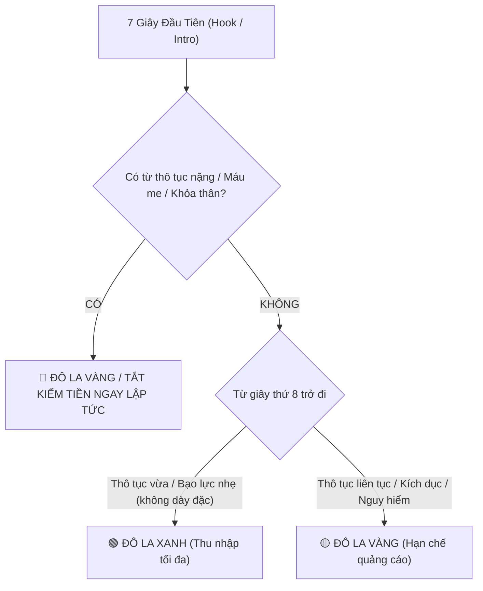

# CẨM NANG NỘI DUNG PHÙ HỢP VỚI NHÀ QUẢNG CÁO (ADVERTISER-FRIENDLY DEEP-DIVE)

> **Căn cứ pháp lý gốc**: Tài liệu `6162278_Nguyên_tắc_về_nội_dung_phù_hợp_với_nhà_quảng_cáo.md` (Dung lượng gốc: 131 KB)  
> **Mục tiêu**: Giúp kịch bản video đạt trạng thái **Đô la Xanh (Green Monetization)**, tránh bị **Đô la Vàng (Limited Ads)** hoặc **Tắt kiếm tiền (No Ads)**.

---

## 1. NGUYÊN TẮC VÀNG: QUY TẮC 7 GIÂY ĐẦU TIÊN (FIRST 7 SECONDS RULE)

Hệ thống AI phân loại quảng cáo tự động của YouTube (Automated Ad-Suitability Classifier) tập trung quét khắt khe nhất trong **7 giây đầu tiên** (tương đương khoảng **18 – 25 từ đầu tiên** khi đọc thoại tiếng Việt ở tốc độ bình thường):

### Các điều cấm kỵ tuyệt đối trong 7 giây đầu:
1. **Tuyệt đối không chửi thề nặng**: Các từ như *đ*t, l*n, cặc, fuck, motherfucker...* xuất hiện trong 7s đầu sẽ biến video thành Đô la Vàng hoặc Tắt quảng cáo ngay lập tức.
2. **Tuyệt đối không mô tả hoặc trình chiếu hình ảnh đẫm máu**: Cảnh chặt chém, tai nạn thảm khốc, vết thương hở trong 7s đầu (kể cả trong trò chơi điện tử/game) sẽ khiến video bị phạt.
3. **Tuyệt đối không chứa yếu tố kích dục hoặc âm thanh rên rỉ**: Không dùng âm thanh gợi dục để làm hook mở đầu.

---

## 2. PHÂN LOẠI 3 CẤP ĐỘ NGÔN TỪ THÔ TỤC (PROFANITY CLASSIFICATION)

| Cấp độ | Ví dụ từ ngữ (Tiếng Việt & Tiếng Anh) | Trong 7 giây đầu | Sau 7 giây đầu | Trong Tiêu đề & Thumbnail |
|:---|:---|:---:|:---:|:---:|
| **Mức 1: Nhẹ (Mild)** | *Chết tiệt, đồ khốn kiếp, quỷ tha ma bắt, quái quỷ, damn, hell, crap...* | 🟢 Đô la Xanh | 🟢 Đô la Xanh | 🟢 Đô la Xanh |
| **Mức 2: Trung bình (Moderate)** | *Con đĩ, con điếm, đồ chó chết, đồ ngu, đồ rác rưởi, bitch, asshole, shit, bastard...* | 🟡 Đô la Vàng | 🟢 Đô la Xanh (nếu dùng thỉnh thoảng, không liên tục) | 🟡 Đô la Vàng |
| **Mức 3: Nặng & Nghiêm trọng (Strong & Severe)** | *Đ\*t, l\*n, cặc, vãi l\*n, đ\*t mẹ mày, fuck, motherfucker, cunt, các từ lăng mạ tình dục, từ miệt thị sắc tộc/tôn giáo...* | 🔴 Không có quảng cáo / Đô la Vàng nặng | 🟡 Đô la Vàng (nếu lặp lại) / 🟢 Xanh (chỉ khi bíp âm thanh và che chữ) | 🔴 Bị tắt kiếm tiền hoàn toàn |

> [!TIP]
> **Giải pháp kỹ thuật kịch bản**: Nếu kịch bản yêu cầu đối thoại giang hồ, kịch tính hoặc diễn xuất có chửi thề, hãy chỉ định ghi chú: `[Hậu kỳ: Chèn tiếng BEEP và che miệng nhân vật]`. Đồng thời, đẩy câu thoại đó ra **sau giây thứ 15**.

---

## 3. BẠO LỰC & MÁU ME (VIOLENCE & GORE)

### 🟢 Nội dung được phép bật kiếm tiền đầy đủ (Đô la Xanh):
- Cảnh thực thi pháp luật thông thường (bắt giữ nghi phạm, truy đuổi không đẫm máu).
- Trò chơi điện tử (Gaming): Cảnh bạo lực, đấu súng trong game xuất hiện **sau 7 giây đầu tiên**.
- Nội dung phim ảnh, kịch dàn dựng có cảnh đánh nhau không có thương tích phản cảm hoặc máu me đầm đìa.
- Thảo luận học thuật về các sự kiện lịch sử, chiến tranh trong quá khứ có bối cảnh tư liệu rõ ràng.
- Thể thao đối kháng (Boxing, MMA, đấu kiếm) trong khuôn khổ nhà thi đấu chuyên nghiệp.

### 🟡 Nội dung bị hạn chế quảng cáo (Đô la Vàng):
- Cảnh quay mô tả vết thương gãy xương, vết thương hở trong bối cảnh tin tức giáo dục.
- Cảnh đánh nhau đường phố thực tế không nhằm mục đích giáo dục.
- Cảnh thi thể trong tang lễ hoặc tai nạn đã được che mờ/làm mờ (pixelated).
- Cảnh bạo lực game quá chi tiết đẫm máu xuất hiện trên Hình thu nhỏ (Thumbnail).

### 🔴 Nội dung không có quảng cáo / Vi phạm nguyên tắc:
- Cảnh quay tập trung vào máu me, lòng mề, nội tạng, vết thương hở bị biến dạng.
- Trực tiếp cho thấy khoảnh khắc tử vong của con người do tai nạn hoặc bạo lực.
- Cảnh tra tấn dã man, hành quyết, chặt đầu (kể cả trong game nếu cố tình tạo ra để gây sốc).
- Hành vi ngược đãi động vật: đá đập, bỏ đói, ép súc vật cắn xé nhau (chọi gà, chọi chó).

---

## 4. NỘI DUNG NGƯỜI LỚN & TÌNH DỤC (ADULT CONTENT)

| Tiêu chí | 🟢 Đô la Xanh | 🟡 Đô la Vàng | 🔴 Tắt kiếm tiền / Xóa video |
|:---|:---|:---|:---|
| **Lãng mạn & Tình cảm** | Hôn môi, âu yếm lãng mạn, nắm tay, khiêu vũ thân mật. | Cảnh nhảy múa cọ xát cơ thể gợi dục, mặc bikini hở hang phóng to vào bộ phận nhạy cảm. | Hành vi khiêu dâm lộ liễu, mô phỏng quan hệ tình dục. |
| **Giáo dục giới tính** | Kiến thức sinh sản, phòng chống bệnh STD, giải phẫu học minh họa bằng tranh vẽ/hình nộm. | Chia sẻ trải nghiệm tình dục thân mật, sử dụng từ ngữ ám chỉ chuyện giường chiếu. | Audio truyện sex, hướng dẫn tư thế quan hệ, thủ dâm, fetish tình dục kỳ dị. |
| **Trang phục & Khỏa thân** | Mặc đồ bơi ở bãi biển, người mẹ cho con bú (có trẻ xuất hiện đúng bối cảnh). | Tranh tượng nghệ thuật cổ điển để lộ bộ phận sinh dục. | Lộ núm vú phụ nữ, lộ bộ phận sinh dục, đồ chơi tình dục (sex toys). |

---

## 5. CÁC VẤN ĐỀ GÂY TRANH CÃI & SỰ KIỆN NHẠY CẢM (SENSITIVE EVENTS)

Các sự kiện sau đây bị xếp vào diện "Nhạy cảm cao" (High Sensitivity):
- **Chiến tranh & Xung đột vũ trang** đang diễn ra (ví dụ: Nga - Ukraine, Trung Đông...).
- **Thảm họa thiên nhiên thảm khốc** (Động đất, sóng thần, lũ lụt cướp đi nhiều sinh mạng).
- **Vụ xả súng hàng loạt, đánh bom khủng bố, án mạng chấn động dư luận**.
- **Đại dịch toàn cầu hoặc khủng hoảng y tế khẩn cấp**.

### Quy tắc sống còn khi viết kịch bản về Sự kiện Nhạy cảm:
1. **Không giật gân, trục lợi**: Tuyệt đối không đặt tiêu đề câu view bằng cảm xúc hoảng loạn (ví dụ: *\"Kinh hoàng tận thế\", \"Xác chết la liệt\"...*).
2. **Giữ giọng điệu trung lập, tôn trọng**: Trình bày thông tin như một phóng viên điều tra hoặc nhà nghiên cứu lịch sử.
3. **Cung cấp bối cảnh nhân đạo**: Bày tỏ sự chia sẻ với các nạn nhân, không biến nỗi đau thành trò tiêu khiển hay công cụ kiếm tiền.
4. **Nếu không có bối cảnh EDSA**: Video chắc chắn sẽ bị gắn cờ Vàng hoặc tắt kiếm tiền hoàn toàn.

---

## 6. HÀNH VI BẤT CHÍNH & TỘI PHẠM MẠNG (DISHONEST BEHAVIOR)

YouTube cấm tuyệt đối các kịch bản hướng dẫn hoặc cổ xúy các hành vi:
- **Bẻ khóa phần mềm (Cracking/Patching)**: Hướng dẫn tải Win lậu, key crack Photoshop, tool hack game.
- **Xâm nhập trái phép (Hacking)**: Hướng dẫn hack Facebook, đọc trộm tin nhắn Zalo, hack Wi-Fi hàng xóm.
- **Gian lận thi cử & làm giả giấy tờ**: Làm giả bằng lái xe, làm giả CCCD, dùng AI gian lận bài thi.
- **Lừa đảo tài chính**: Hướng dẫn thủ thuật trốn nợ ngân hàng, bùng app vay tiền, rửa tiền.

---

## 7. BẢNG TRA CỨU 4 TRẠNG THÁI BIỂU TƯỢNG KIẾM TIỀN (MONETIZATION ICONS)

| Biểu tượng | Trạng thái | Ý nghĩa kỹ thuật | Hành động của tác giả kịch bản |
|:---:|:---|:---|:---|
| 🟢 | **Đô la Xanh** | Video phù hợp với tất cả nhà quảng cáo. Doanh thu RPM/CPM cao nhất. | Duy trì chuẩn mực kịch bản hiện tại. |
| 🟡 | **Đô la Vàng** | Hạn chế quảng cáo hoặc không có quảng cáo do nội dung không phù hợp với phần lớn thương hiệu. | Xem xét báo cáo audit, hoán đổi từ khóa nhạy cảm, dời câu nói đùa/từ bậy ra xa phần Intro, nộp đơn Request Human Review nếu tự tin đúng chuẩn. |
| 🔘 | **Đô la Xám** | Video không đủ điều kiện kiếm tiền (hoặc tính năng kiếm tiền bị tắt thủ công). | Kiểm tra lại bản quyền âm nhạc hoặc tính năng kiếm tiền của kênh. |
| 🔴 | **Đô la Đỏ** | Video dính khiếu nại bản quyền Content ID (chia sẻ doanh thu cho bên thứ 3) hoặc bị gậy cấm kiếm tiền. | Thay thế nhạc nền bản quyền, cắt bỏ phân đoạn vi phạm bản quyền. |
