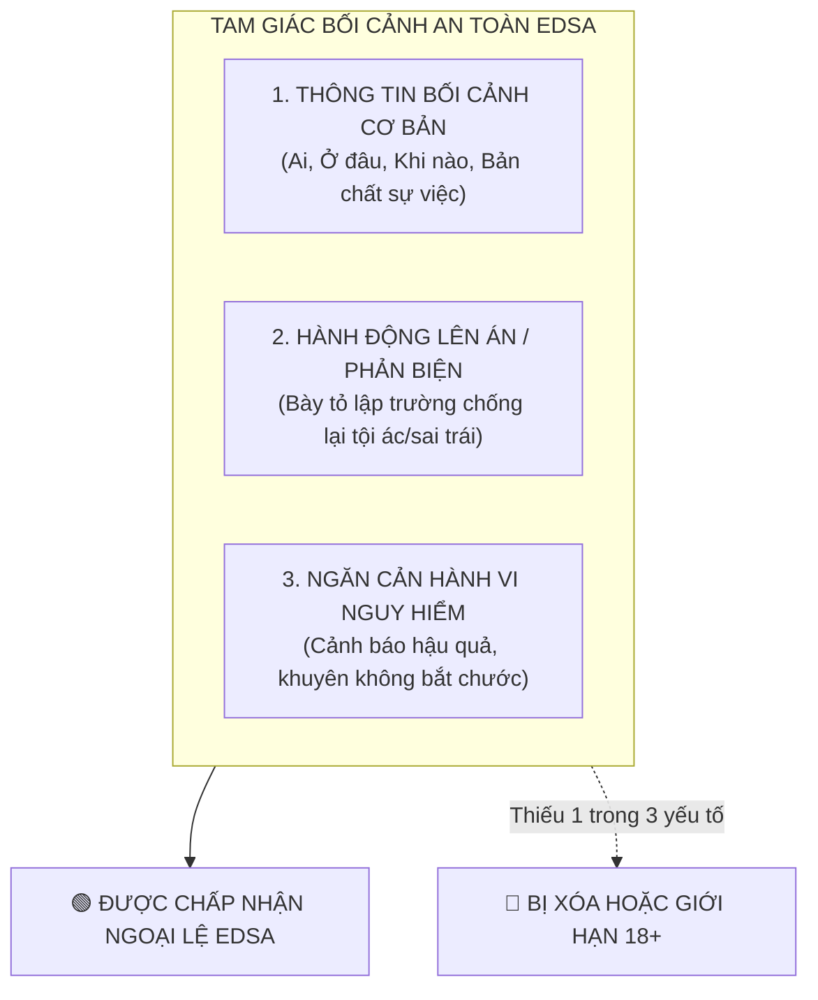

# HƯỚNG DẪN ÁP DỤNG NGOẠI LỆ EDSA (GIÁO DỤC, TƯ LIỆU, KHOA HỌC, NGHỆ THUẬT)

> **Căn cứ pháp lý gốc**: Tài liệu `6345162_Cách_YouTube_đánh_giá_nội_dung_mang_tính_giáo_dục,_tư_liệu,_khoa_học_và_ngh.md`  
> **Khái niệm EDSA**: **E**ducational (Giáo dục), **D**ocumentary (Tư liệu/Tài liệu), **S**cientific (Khoa học), **A**rtistic (Nghệ thuật).  
> **Tầm quan trọng**: EDSA là **"kim bài miễn tử"** duy nhất giúp kịch bản khai thác các đề tài gai góc (tội phạm, chiến tranh, y tế, lịch sử, phản ánh tiêu cực) không bị AI của YouTube gắn cờ vi phạm hoặc xóa video.

---

## 1. BA TRỤ CỘT BẮT BUỘC ĐỂ ĐẠT NGOẠI LỆ EDSA

Theo quy định chính thức của YouTube, một nội dung chứa các yếu tố nhạy cảm chỉ được miễn trừ xử phạt nếu kịch bản tích hợp đầy đủ **3 yếu tố bối cảnh** sau:

### Chi tiết từng trụ cột:
1. **Thông tin bối cảnh cơ bản (Background Information)**:
   - Phải giải thích rõ: Đây là vụ án xảy ra năm nào? Ở quốc gia nào? Nhân vật lịch sử hay hư cấu?
   - Không đưa tình tiết giật gân lơ lửng mà không gắn với bối cảnh thực tế.
2. **Lên án và phản đối (Condemnation / Counter-speech)**:
   - Kịch bản phải có lời bình thể hiện rõ sự phản đối đối với hành vi phạm pháp, bạo lực, lừa đảo hoặc phân biệt đối xử.
   - Tránh tuyệt đối giọng điệu ca ngợi, thần tượng hóa tội phạm ("tên cướp hào hoa", "ông trùm siêu ngầu").
3. **Ngăn cản hành vi nguy hiểm (Discouragement)**:
   - Nhấn mạnh cái giá phải trả: Bản án của tòa án, hậu quả thương tật, sự trừng phạt của pháp luật.
   - Đưa ra lời khuyên người xem không được tự ý làm theo hoặc bắt chước.

---

## 2. NĂM BỘ MẪU TUYÊN BỐ MIỄN TRỪ TRÁCH NHIỆM (DISCLAIMER TEMPLATES)

Tác giả kịch bản hãy chọn mẫu phù hợp nhất để chèn vào phần đầu kịch bản (Text hiển thị 0s - 5s và giọng đọc thuyết minh):

### Mẫu 1: Kịch bản Vụ án / Phá án / Tội phạm học (True Crime / Case Study)
> **[DISCLAIMER - TEXT HIỂN THỊ TRÊN MÀN HÌNH & LỜI DẪN]**:  
> *"Video này được sản xuất nhằm mục đích tư liệu, phổ biến kiến thức pháp luật và nâng cao ý thức cảnh giác cho cộng đồng trước các thủ đoạn tội phạm. Mọi hành vi vi phạm pháp luật được nhắc đến trong video đều bị pháp luật nghiêm trị và cộng đồng lên án. Người xem tuyệt đối không bắt chước dưới bất kỳ hình thức nào. Một số chi tiết đã được làm mờ để bảo vệ quyền riêng tư của các bên liên quan."*

### Mẫu 2: Kịch bản Lịch sử / Chiến tranh / Xung đột quân sự
> **[DISCLAIMER - TEXT HIỂN THỊ TRÊN MÀN HÌNH & LỜI DẪN]**:  
> *"Nội dung video dựa trên các tài liệu nghiên cứu lịch sử và báo chí đã được công bố chính thức, nhằm mục đích giáo dục và ghi nhận lịch sử khách quan. Kênh không có mục đích cổ vũ chiến tranh, bạo lực hay kích động thù hằn dân tộc. Toàn bộ hình ảnh tư liệu bạo lực đã được xử lý làm mờ theo tiêu chuẩn cộng đồng."*

### Mẫu 3: Kịch bản Sức khỏe / Y học / Thảo dược dân gian
> **[DISCLAIMER - TEXT HIỂN THỊ TRÊN MÀN HÌNH & LỜI DẪN]**:  
> *"Thông tin trong video chỉ mang tính chất tham khảo kiến thức khoa học và kinh nghiệm dân gian, không thay thế cho chẩn đoán hay phác đồ điều trị của bác sĩ chuyên khoa. Người bệnh tuyệt đối không tự ý ngưng thuốc hoặc tự điều trị tại nhà mà không có chỉ định y tế chính thức."*

### Mẫu 4: Kịch bản Thể thao mạo hiểm / Kỹ năng sinh tồn / Thí nghiệm khoa học
> **[DISCLAIMER - TEXT HIỂN THỊ TRÊN MÀN HÌNH & LỜI DẪN]**:  
> *"Các hoạt động trong video được thực hiện bởi chuyên gia được đào tạo chuyên nghiệp trong điều kiện an toàn có kiểm soát nghiêm ngặt. Khán giả không được tự ý thực hiện lại ở nhà hoặc nơi công cộng do tiềm ẩn nguy cơ chấn thương nguy hiểm."*

### Mẫu 5: Kịch bản Kịch tình huống / Phim ngắn có xung đột xã hội
> **[DISCLAIMER - TEXT HIỂN THỊ TRÊN MÀN HÌNH & LỜI DẪN]**:  
> *"Đây là tác phẩm nghệ thuật hư cấu được dàn dựng bởi các diễn viên chuyên nghiệp nhằm mục đích phản ánh các mặt trái xã hội và truyền tải thông điệp nhân văn. Mọi tình huống bạo lực giả định đều nhằm mục đích lên án cái ác và ca ngợi lối sống thượng tôn pháp luật."*

---

## 3. VỊ TRÍ CẤY BỐI CẢNH EDSA TRONG KỊCH BẢN (PLACEMENT MATRIX)

Để AI kiểm duyệt của YouTube nhận diện được EDSA ngay từ khâu xử lý video tự động, bối cảnh phải xuất hiện ở **4 điểm tiếp xúc**:

| Vị trí trong kịch bản | Cách thể hiện cụ thể | Mục đích kỹ thuật đối với AI YouTube |
|:---|:---|:---|
| **1. Mở đầu kịch bản (0s – 5s)** | - Chèn bảng Text Disclaimer trên màn hình. - Voiceover đọc 1 câu tuyên bố mục đích giáo dục. | AI nhận diện ngay nhãn EDSA qua OCR quét phụ đề và Audio-to-Text. |
| **2. Trong lời bình (Voiceover xuyên suốt)** | Chêm các từ khóa định hướng học thuật: *"Theo hồ sơ điều tra...", "Về mặt pháp lý...", "Các chuyên gia cảnh báo rằng..."*. | Ngăn chặn hệ thống hiểu nhầm là nội dung kích động bạo lực. |
| **3. Kết thúc kịch bản (Outro & Payoff)** | Đúc kết bài học cảnh giác, lời khuyên tuân thủ pháp luật, hướng thiện. | Khẳng định giá trị nhân văn và tính toàn vẹn của nội dung. |
| **4. Mô tả video & Bình luận ghim** | Ghi rõ: *"Video thuộc thể loại tư liệu giáo dục (EDSA)..."* kèm nguồn tài liệu tham khảo. | Tăng độ uy tín Metadata khi có nhân viên YouTube xem xét thủ công (Human Review). |
