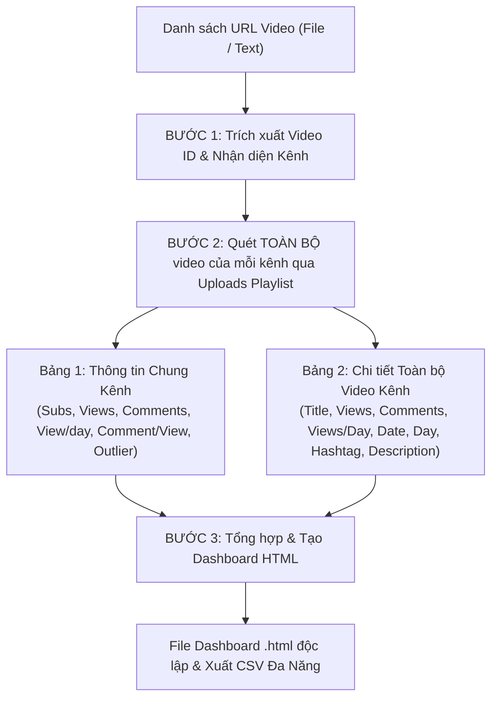

# YouTube Competitor Analyzer Skill (`/yt-competitor-analyzer`)

Kỹ năng chuyên sâu dành cho **SubAgent Phân tích Kênh Đối thủ (YouTube Competitor Auditor)**. Chịu trách nhiệm nhận diện kênh từ video đầu vào, quét sạch **toàn bộ kho video** của các kênh đối thủ, đối soát chỉ số và trực quan hóa dữ liệu thành Dashboard HTML tương tác cao.

---

## 1. Mục tiêu & Luồng Xử lý (Workflow Pipeline)



---

## 2. Quy chuẩn Dữ liệu 2 Bảng Thông tin

### Bảng 1: Thông tin chung các Kênh (Channel Overview Table)
| Cột Dữ Liệu | Nguồn / Công thức tính | Ý nghĩa chiến lược |
| :--- | :--- | :--- |
| **Tên kênh** | `snippet.title` kèm hyperlink tới `customUrl` hoặc `channelId` | Định danh kênh đối thủ |
| **Subscribers** | `statistics.subscriberCount` | Quy mô tệp người theo dõi |
| **Views** | `statistics.viewCount` | Tổng lượt xem toàn bộ kênh từ ngày thành lập |
| **Comments** | Tổng comment của toàn bộ video đã quét trên kênh | Mức độ tương tác bình luận thực tế toàn kênh |
| **View/day** | $\frac{\text{Tổng View}}{\text{Số ngày từ khi lập kênh đến nay}}$ | Tốc độ tăng trưởng lượt xem trung bình mỗi ngày |
| **Comment/View** | $\frac{\text{Tổng Comments}}{\text{Tổng Views}} \times 100\%$ | Tỷ lệ chuyển đổi người xem thành người bình luận |
| **Outlier** | Số lượng video có $\text{Views} \ge 2 \times \text{Subscribers}$ | **Hint:** *"Đây là các video có lượt xem =2 lần số subcriber của kênh"*. Bấm vào để lọc video outlier của kênh. |
| **Hành Động** | Nút "Xem Video" & Nút "CSV" | Xem chi tiết video hoặc tải ngay file CSV riêng cho kênh |

### Bảng 2: Danh sách chi tiết Toàn Bộ Video (Video Details Table)
| Cột Dữ Liệu | Nguồn / Công thức tính | Vị trí / Ý nghĩa |
| :--- | :--- | :--- |
| **1. Kênh** | `snippet.channelTitle` | Phân loại video thuộc kênh nào |
| **2. Tiêu đề video** | `snippet.title` kèm hyperlink tới video | Tựa đề, kèm badge Outlier nếu $\ge 2\times\text{Sub}$ |
| **3. Views** | `statistics.viewCount` | Độ lan tỏa của video |
| **4. Comments** | `statistics.commentCount` | Độ sôi nổi tranh luận của khán giả |
| **5. Views / Day** | $\frac{\text{Views}}{\max(1, \text{Day})}$ | **Tốc độ tăng trưởng view trung bình mỗi ngày của video** |
| **6. Date** | `snippet.publishedAt` (Định dạng: `YYYY-MM-DD`) | Thời điểm đăng video |
| **7. Day** | $\lfloor \frac{\text{Now} - \text{PublishedAt}}{86400000} \rfloor$ ngày | Tuổi thọ video tính theo ngày |
| **8. Hashtags** | Regex trích xuất `#...` từ title & description + `snippet.tags` | **Đẩy ra sau** (Clickable để lọc) |
| **9. Descriptions** | `snippet.description` (có modal mở rộng) | **Đẩy ra sau cùng** |

---

## 3. Chức Năng Xuất Video (CSV) Đa Năng
Khi bấm **"Xuất Video (CSV)"**, hệ thống cung cấp 3 tùy chọn:
1. **Toàn bộ video của tất cả các kênh**: Xuất trọn vẹn toàn bộ kho video đã quét.
2. **Theo bộ lọc hiện tại**: Xuất danh sách video đang được lọc trên Bảng 2.
3. **Theo từng kênh cụ thể**: Cho phép chọn 1 kênh trong dropdown hoặc bấm trực tiếp nút CSV tại Bảng 1.
*File CSV xuất ra bao gồm đầy đủ 11 cột dữ liệu chuẩn chỉnh của Bảng 2:*
`Kênh` | `Tiêu Đề Video` | `URL Video` | `Views` | `Comments` | `Views/Day` | `Ngày Đăng` | `Số Ngày Đã Trôi Qua` | `Outlier (>=2x Sub)` | `Hashtags` | `Descriptions`

Đặc tính kỹ thuật:
- Sử dụng UTF-8 BOM (`\uFEFF`) để mở trực tiếp trên Microsoft Excel tiếng Việt không bị lỗi font.
- Cơ chế `Blob` + `URL.createObjectURL` chống ngắt dòng do ký tự hashtag `#` hoặc giới hạn URL.
- Toàn bộ ngắt dòng trong mô tả được chuẩn hóa thành dấu cách, giữ mỗi video trên đúng 1 dòng.

---

## 4. Kịch bản Thực thi Tự động (Execution Script)

Bộ script chuẩn Node.js tại:
`skills/marketing/yt-competitor-analyzer/scripts/analyze.js`
(sau `install.ps1` flatten: `skills/yt-competitor-analyzer/scripts/analyze.js`)

### Cách chạy:
```bash
# Phân tích và quét toàn bộ video các kênh từ tệp (đường dẫn input/output do Sếp chỉ định):
node skills/marketing/yt-competitor-analyzer/scripts/analyze.js --input path/to/urls.txt --output path/to/dashboard.html

# Hoặc truyền trực tiếp chuỗi URL:
node skills/marketing/yt-competitor-analyzer/scripts/analyze.js --urls "https://youtu.be/cW4IAoiWIls,https://youtu.be/gfq3O_2GjU0"
```
